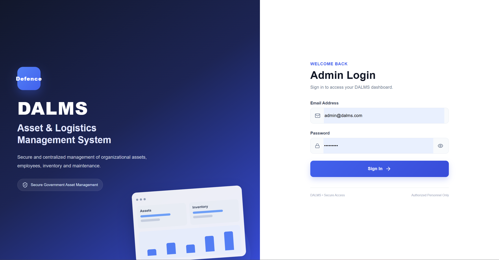
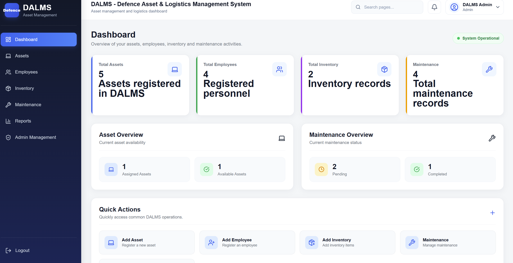
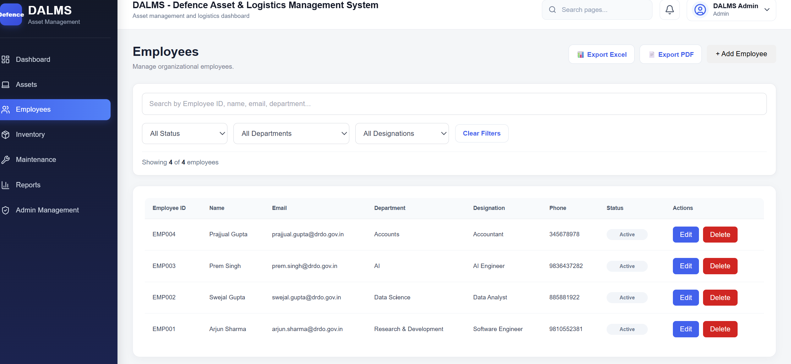
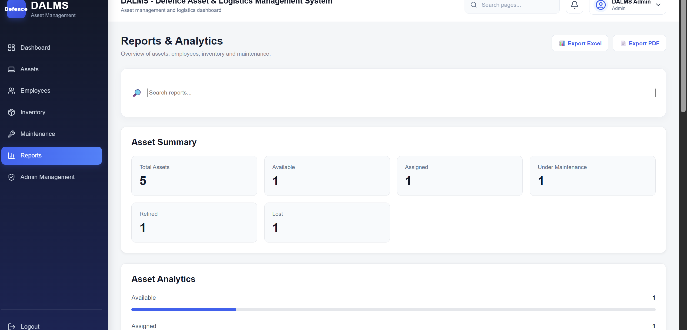

# DALMS — Defence Asset & Logistics Management System

A full-stack web-based asset and logistics management system designed to centralize and streamline the management of defence-oriented assets, employees, inventory, maintenance records, analytics, and operational reports.

DALMS provides a centralized dashboard with management modules, searchable records, data visualization, authentication, and PDF/Excel report generation.

---

## 🚀 Live Demo

**Live Application:** https://dalms-defence-asset-logistics-manag.vercel.app/

### 🔑 Demo Access

Use the following demo account to explore the deployed application:

**Email:** `demo@dalms.in`
**Password:** `demo`

> The demo account is provided for portfolio and project demonstration purposes.

**Frontend:** Vercel
**Backend API:** Render
**Database:** MongoDB Atlas

> The application is deployed and connected to the production backend and MongoDB Atlas database.

---

## 🌐 Project Overview

Managing assets, employees, inventory, and maintenance records across multiple systems can make tracking and reporting difficult.

**DALMS (Defence Asset & Logistics Management System)** addresses this by providing a centralized management platform where authorized users can manage operational records through a structured web interface.

The system combines:

* Asset management
* Employee management
* Inventory management
* Maintenance management
* Searchable records
* Dashboard analytics
* Interactive charts
* PDF report generation
* Excel report generation
* Secure authentication
* RESTful backend APIs

---

## ✨ Key Features

### 📊 Dashboard & Analytics

* Centralized management dashboard
* Summary statistics
* Visual data representation
* Interactive charts
* Quick access to operational records

### 📦 Asset Management

* Create and manage asset records
* Unique Asset ID generation
* View asset records
* Search asset records
* Filter asset records
* Edit asset records
* Delete asset records
* Assign assets to employees
* Track asset status
* Generate PDF reports
* Export records to Excel
* Data visualization

### 👥 Employee Management

* Create and manage employee records
* Search employee records
* View employee records
* Filter employee records
* Edit employee records
* Delete employee records
* Generate PDF reports
* Export records to Excel
* Data visualization

### 📋 Inventory Management

* Manage inventory records
* Search and view inventory data
* Track inventory information
* Edit inventory records
* Delete inventory records
* Generate PDF reports
* Export records to Excel
* Data visualization

### 🔧 Maintenance Management

* Manage maintenance records
* Search maintenance information
* View maintenance records
* Edit maintenance records
* Delete maintenance records
* Track maintenance information
* Generate PDF reports
* Export records to Excel
* Data visualization

### 🔎 Search & Filtering

Major management modules provide structured search and filtering functionality for faster data retrieval.

Users can search records using relevant fields and apply filters based on available categories and statuses.

### 📄 Reporting & Export

DALMS provides reporting functionality across management modules:

* PDF report generation
* Excel/CSV-compatible export
* Tabular PDF reports
* Exportable management records
* Searchable and structured data

### 🔐 Authentication & Security

* JWT-based authentication
* Password hashing using bcrypt
* Protected backend routes
* Environment-based configuration
* HTTP security headers using Helmet
* Input validation
* CORS configuration
* Secure handling of environment variables

### 🔔 Notifications

* Centralized notification management
* Notification records
* Notification API support

### 🧪 API Testing

Backend REST APIs can be tested using the included Postman collection.

---

## 💡 What This Project Demonstrates

DALMS demonstrates practical experience in:

* Full-stack web application development
* React frontend development
* Node.js and Express.js backend development
* REST API development
* MongoDB database integration
* Mongoose data modeling
* JWT-based authentication
* Password hashing and security
* CRUD operations
* API validation
* Data visualization
* PDF report generation
* Excel/CSV export
* Search and filtering
* Frontend-backend integration
* Cloud deployment
* Production CORS configuration
* Git and GitHub-based development workflow

---

## 🏗️ System Architecture

```text
                    ┌─────────────────────────┐
                    │       DALMS User        │
                    └────────────┬────────────┘
                                 │
                                 ▼
                    ┌─────────────────────────┐
                    │   React + Vite Client   │
                    │                         │
                    │ Dashboard               │
                    │ Asset Management        │
                    │ Employee Management     │
                    │ Inventory Management    │
                    │ Maintenance Management  │
                    │ Charts & Reports        │
                    └────────────┬────────────┘
                                 │
                          REST API / Axios
                                 │
                                 ▼
                    ┌─────────────────────────┐
                    │   Node.js + Express     │
                    │                         │
                    │ Authentication          │
                    │ Validation               │
                    │ Business Logic           │
                    │ REST API Routes          │
                    └────────────┬────────────┘
                                 │
                              Mongoose
                                 │
                                 ▼
                    ┌─────────────────────────┐
                    │        MongoDB          │
                    │                         │
                    │ Assets                  │
                    │ Employees               │
                    │ Inventory               │
                    │ Maintenance             │
                    │ User/Auth Data          │
                    └─────────────────────────┘
```

---

## ☁️ Production Deployment

DALMS uses a separated cloud deployment architecture.

```text
                         Production Environment

                    ┌─────────────────────────┐
                    │         Vercel          │
                    │    React + Vite Client  │
                    └────────────┬────────────┘
                                 │
                           HTTPS / REST API
                                 │
                                 ▼
                    ┌─────────────────────────┐
                    │         Render          │
                    │   Node.js + Express API │
                    └────────────┬────────────┘
                                 │
                              Mongoose
                                 │
                                 ▼
                    ┌─────────────────────────┐
                    │     MongoDB Atlas       │
                    │     Cloud Database      │
                    └─────────────────────────┘
```

### Production URLs

* **Frontend:** https://dalms-defence-asset-logistics-manag.vercel.app/
* **Backend API:** https://dalms-defence-asset-logistics-management.onrender.com

### Deployment Technologies

* **Vercel** — Frontend hosting
* **Render** — Backend hosting
* **MongoDB Atlas** — Cloud database
* **GitHub** — Source code repository

---

## 🧩 Main Modules

| Module                 | Purpose                                    |
| ---------------------- | ------------------------------------------ |
| Dashboard              | Overview, statistics and analytics         |
| Asset Management       | Manage organizational assets               |
| Employee Management    | Manage employee records                    |
| Inventory Management   | Manage inventory information               |
| Maintenance Management | Manage maintenance records                 |
| Records                | Search, view and manage stored information |
| Reporting              | Generate PDF and Excel reports             |
| Authentication         | Secure user access                         |
| Administration         | Administrative operations                  |
| Notifications          | Manage application notifications           |

---

## 🛠️ Technology Stack

### Frontend

* React 19
* Vite
* JavaScript
* React Router
* Axios
* Recharts
* jsPDF
* jsPDF-AutoTable
* Lucide React
* ESLint

### Backend

* Node.js
* Express.js
* MongoDB
* Mongoose
* JSON Web Token (JWT)
* bcrypt
* Joi
* Express Validator
* Helmet
* CORS
* Multer
* Morgan
* dotenv

### Development & Testing

* Git
* GitHub
* VS Code
* Postman
* Nodemon

### Deployment

* Vercel
* Render
* MongoDB Atlas

---

## 🔒 Security

DALMS incorporates several backend security and validation mechanisms:

* JWT-based authentication
* Password hashing using bcrypt
* Protected API routes
* Environment variables for sensitive configuration
* Helmet for HTTP security headers
* CORS configuration
* Request validation using Joi and Express Validator
* Sensitive `.env` files excluded from version control
* Passwords are never returned in authentication responses

---

## 📁 Project Structure

```text
DALMS-Defence-Asset-Logistics-Management-System/
│
├── client/
│   ├── public/
│   ├── src/
│   ├── package.json
│   └── .gitignore
│
├── server/
│   ├── config/
│   ├── middleware/
│   ├── modules/
│   │   ├── admins/
│   │   ├── assets/
│   │   ├── auth/
│   │   ├── dashboard/
│   │   ├── employees/
│   │   ├── inventory/
│   │   ├── maintenance/
│   │   ├── notifications/
│   │   └── reports/
│   ├── routes/
│   ├── app.js
│   ├── server.js
│   ├── package.json
│   └── .gitignore
│
├── postman/
│   └── API collection files
│
├── screenshots/
│   ├── login.png
│   ├── dashboard.png
│   ├── assets.png
│   ├── employees.png
│   ├── inventory.png
│   ├── maintenance.png
│   └── records.png
│
├── .gitignore
└── README.md
```

---

## ⚙️ Installation & Setup

### Prerequisites

* Node.js
* npm
* MongoDB Atlas account
* Git
* Postman (optional)

---

### 1. Clone the Repository

```bash
git clone https://github.com/swejalgupta2005/DALMS-Defence-Asset-Logistics-Management-System.git
```

```bash
cd DALMS-Defence-Asset-Logistics-Management-System
```

---

### 2. Install Frontend Dependencies

```bash
cd client
npm install
```

---

### 3. Install Backend Dependencies

Open another terminal or return to the project root:

```bash
cd server
npm install
```

---

## 🔐 Environment Variables

### Backend Environment Variables

Create a `.env` file inside the `server` directory.

Example:

```env
PORT=5000
MONGODB_URI=your_mongodb_connection_string
JWT_SECRET=your_jwt_secret
```

### Frontend Environment Variables

Create a `.env` file inside the `client` directory.

For local development:

```env
VITE_API_URL=http://localhost:5000
```

For production, configure the frontend API URL to point to the deployed Render backend.

> Never commit real `.env` files, database credentials, JWT secrets, or other sensitive information to GitHub.

---

## ▶️ Run the Application

### Start Backend

Inside the `server` directory:

```bash
npm run dev
```

The backend runs locally on:

```text
http://localhost:5000
```

### Start Frontend

Inside the `client` directory:

```bash
npm run dev
```

Vite will provide the local frontend URL in the terminal.

---

## 🔌 API

The backend exposes RESTful APIs for the major DALMS modules.

| Module         | Endpoint             |
| -------------- | -------------------- |
| Authentication | `/api/auth`          |
| Assets         | `/api/assets`        |
| Employees      | `/api/employees`     |
| Inventory      | `/api/inventory`     |
| Maintenance    | `/api/maintenance`   |
| Dashboard      | `/api/dashboard`     |
| Reports        | `/api/reports`       |
| Administration | `/api/admins`        |
| Notifications  | `/api/notifications` |

Authentication-protected endpoints require a valid JWT bearer token.

---

## 🧪 Postman Testing

The repository includes a `postman/` directory containing API testing resources.

The collection can be imported into Postman to test backend endpoints.

Typical API testing includes:

* Authentication
* Asset operations
* Employee operations
* Inventory operations
* Maintenance operations
* Dashboard statistics
* Reports
* Administrative operations
* Notifications

---

## 📊 Reporting

DALMS supports management reporting through:

### PDF

PDF reports are generated using:

* jsPDF
* jsPDF-AutoTable

### Excel

Management records can be exported into Excel-compatible spreadsheet files.

Reporting functionality is available across the major management modules.

---

## 📈 Analytics & Visualization

DALMS uses **Recharts** to provide graphical representations of management data.

Charts help users understand operational information more quickly than raw records alone.

The dashboard provides visual summaries of important operational data.

---

## 📸 Screenshots

### 🔐 Login



### 📊 Dashboard



### 📦 Asset Management


### 👥 Employee Management



### 📋 Inventory Management


### 🔧 Maintenance Management


### 🔎 Records & Search



---

## 📌 Production Status

DALMS is currently **deployed and operational**.

### Verified Production Features

* Authentication and login
* Demo account access
* Dashboard statistics
* Interactive charts
* Asset management
* Employee management
* Inventory management
* Maintenance management
* Search and filtering
* PDF exports
* Excel exports
* REST API communication
* MongoDB Atlas connectivity
* Cloud deployment

---

## 🎯 Project Goals

The primary goals of DALMS are to:

* Centralize asset and logistics information
* Reduce manual record management
* Improve accessibility of operational data
* Provide structured management modules
* Enable faster searching and reporting
* Provide visual analytics
* Simplify report generation
* Improve data organization and system security

---

## 🔮 Future Enhancements

Potential future improvements include:

* Role-based access control
* Advanced audit logging
* Real-time notifications
* Advanced analytics
* Elastic Stack integration for centralized application logging and monitoring
* Docker-based deployment
* CI/CD pipeline
* Advanced filtering and reporting
* Automated backups
* Asset lifecycle tracking
* Fine-grained user permissions

---

## 📌 Disclaimer

DALMS is an independent academic/portfolio project designed around defence-oriented asset and logistics management concepts.

It is **not an official application of DRDO, the Indian Army, or any Government of India organization**.

---

## 👩‍💻 Author

**Swejal Gupta**

B.Tech — Computer Science & Engineering (Data Science)

GitHub: https://github.com/swejalgupta2005

---

## ⭐ If You Find This Project Useful

Consider giving the repository a ⭐ on GitHub.

